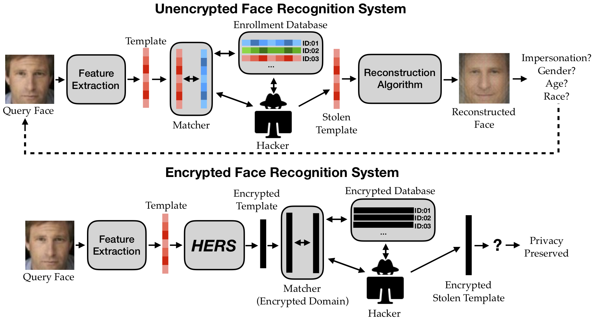

# HERS: Homomorphically Encrypted Representation Search [[arXiv]](https://arxiv.org/abs/2003.12197)
```BibTex
@article{engelsma2022hers,
  title={{HERS}: Homomorphically Encrypted Representation Search},
  author={Engelsma, Joshua J and Jain, Anil K and Boddeti, Vishnu Naresh},
  journal={IEEE Transactions on Biometrics, Behavior, and Identity Science},
  year={2022},
  publisher={IEEE}
}
```

## Overview


## Requirements
- Python
- Tensorflow
